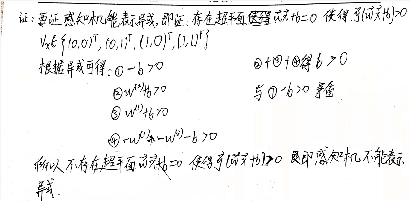
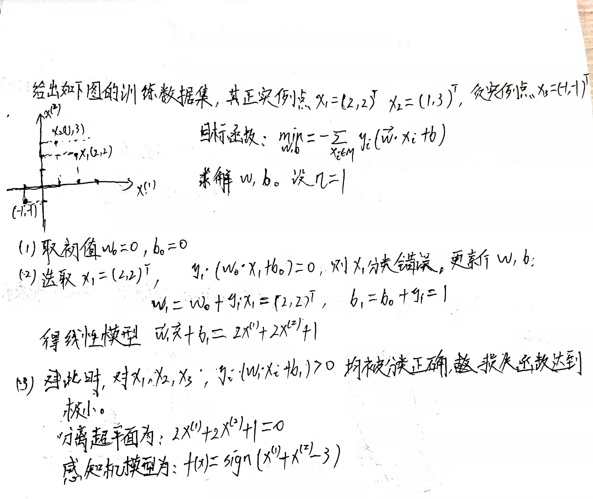

##### 2.1 Minsky与Papert指出：感知机因为是线性模型，所以不能表示复杂的函数，如异或（XOR）。验证感知机为什么不能表示异或。
>答：
> 异或运算：
> 
>| 序号 | x | f(x) |
>| :---: | :---: | :---: |
>| 1 | (0,0) | 0 |
>| 2 | (0,1) | 1 |
>| 3 | (1,0) | 1 |
>| 4 | (1,1) | 0 |
> 
>由异或的坐标系表示可知异或运算不是线性可分的。
>```python
>x = np.array([[0,0],[1,1],[1,0],[0,1]])
>plt.scatter(x[:2,0],x[:2,1], marker='o', color='red', label='Pos')
>plt.scatter(x[2:,0],x[2:,1], marker='x', color='blue', label='Neg')
>plt.xlabel('x1')
>plt.ylabel('x2')
>plt.show() 
>```
>
> 证明如下：（反证法）
> 
##### 2.2 模仿例题2.1，构建从训练数据集求解感知机模型的例子。
> 
##### 2.3 证明一下定理：样本集线性可分的充分必要条件是正实例点集所构成的凸壳与负实例点集所构成的凸壳相互不相交。
> 
> 